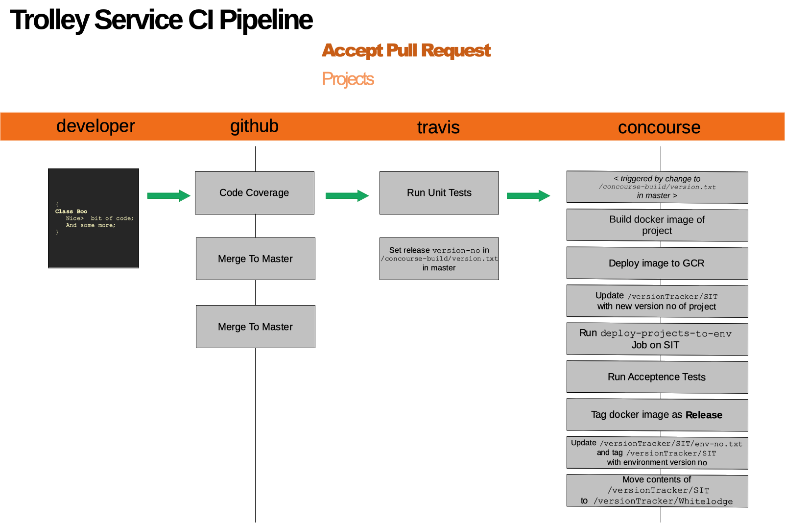
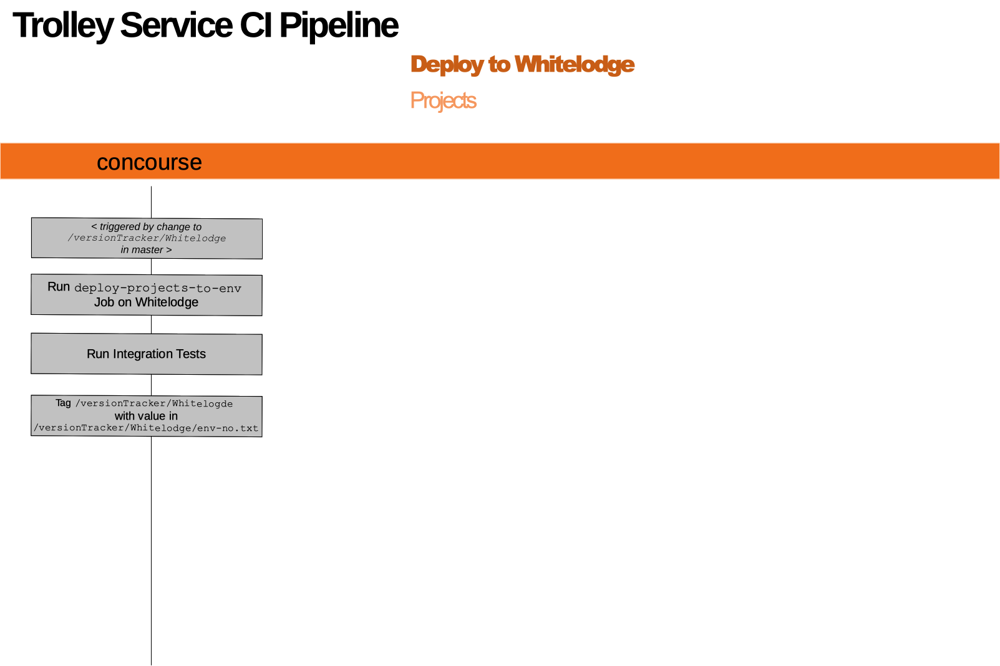
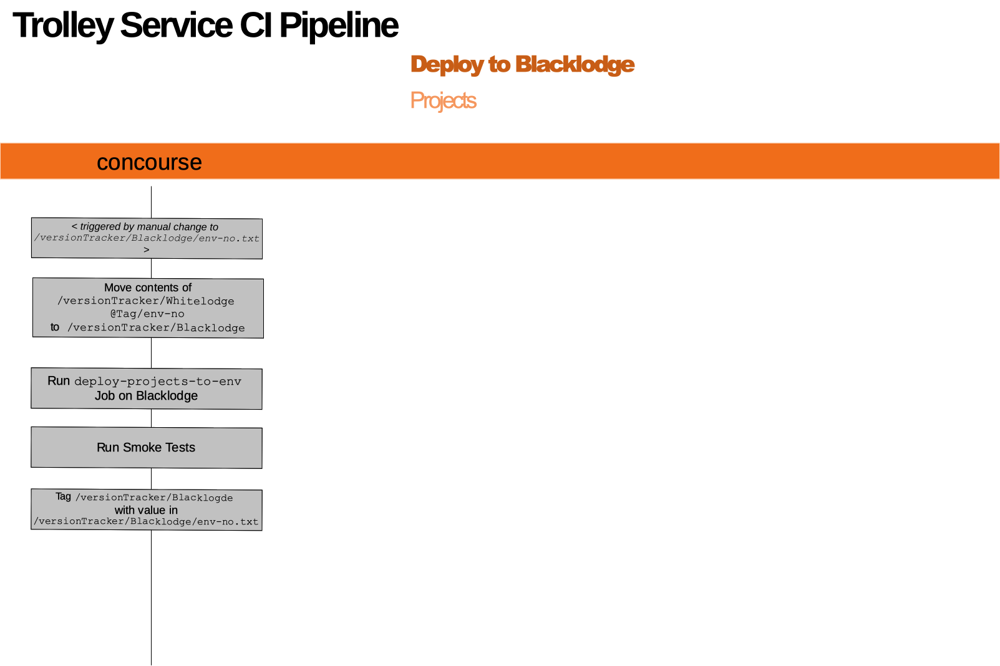
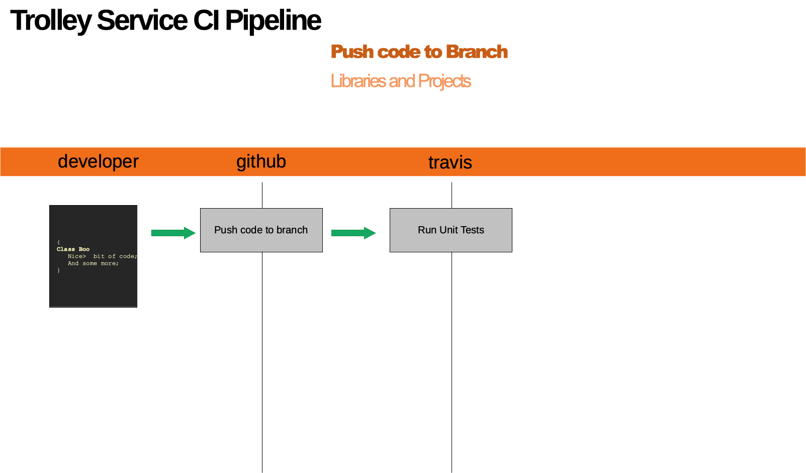
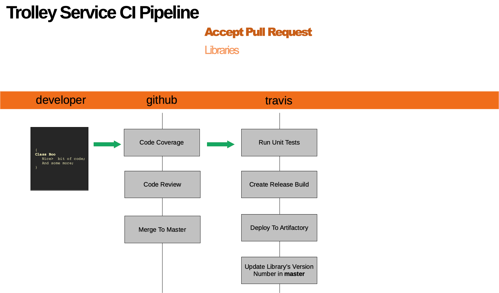

# census-fwmt-env-version

## ci-pull-request-acceptance-projects
 
</kbd>

## deploy-to-whitelodge
 

## deploy-to-blacklodge
 

## ci-push-to-branch
 

## ci-pull-request-acceptance-libraries
 

